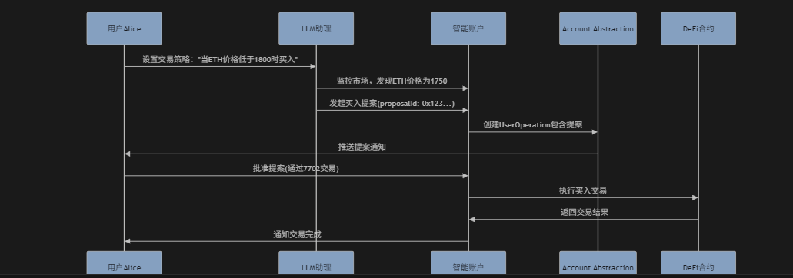
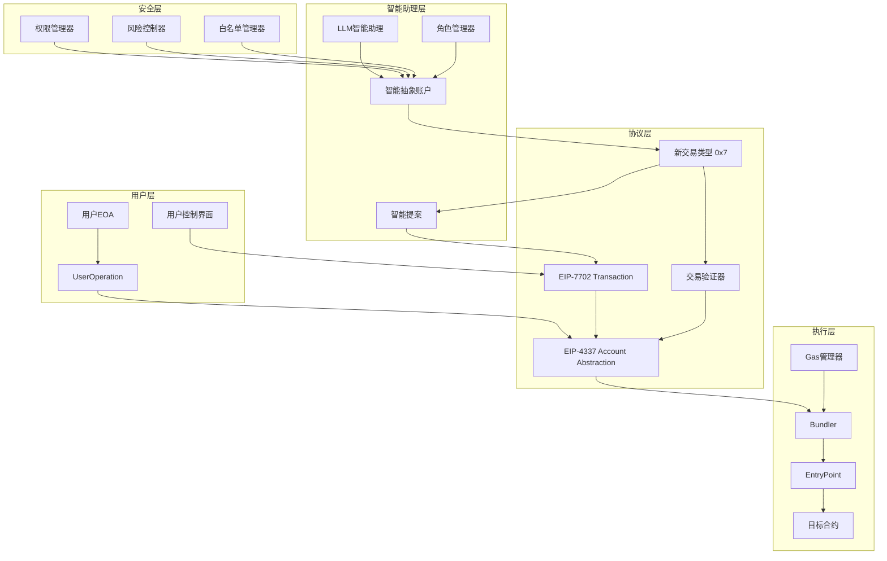
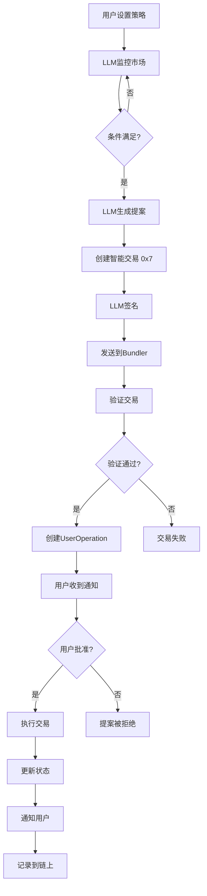
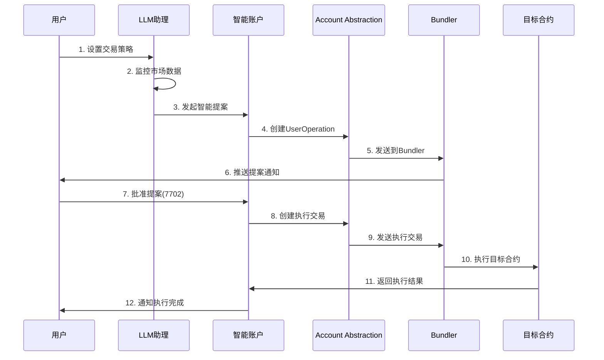
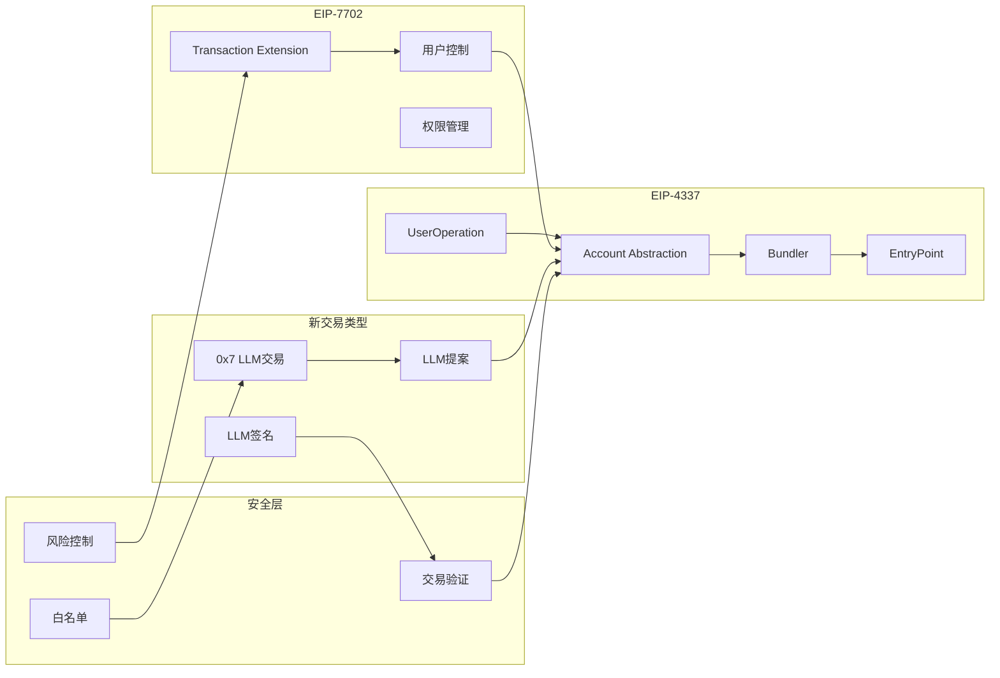
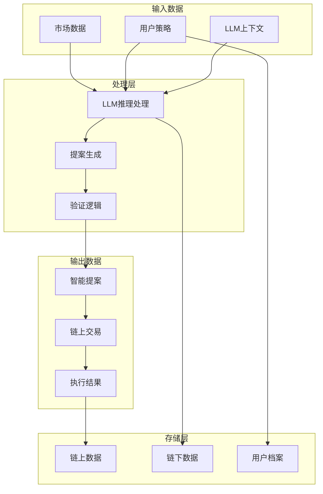
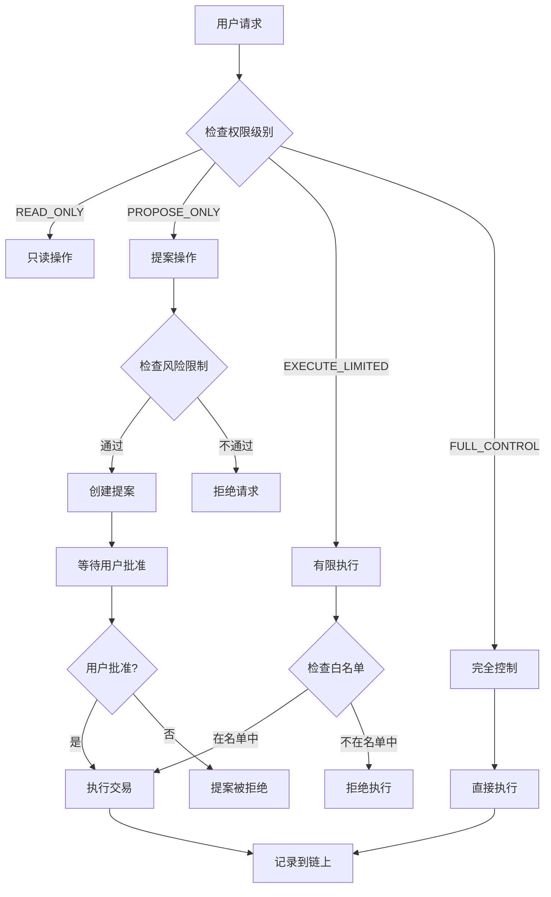
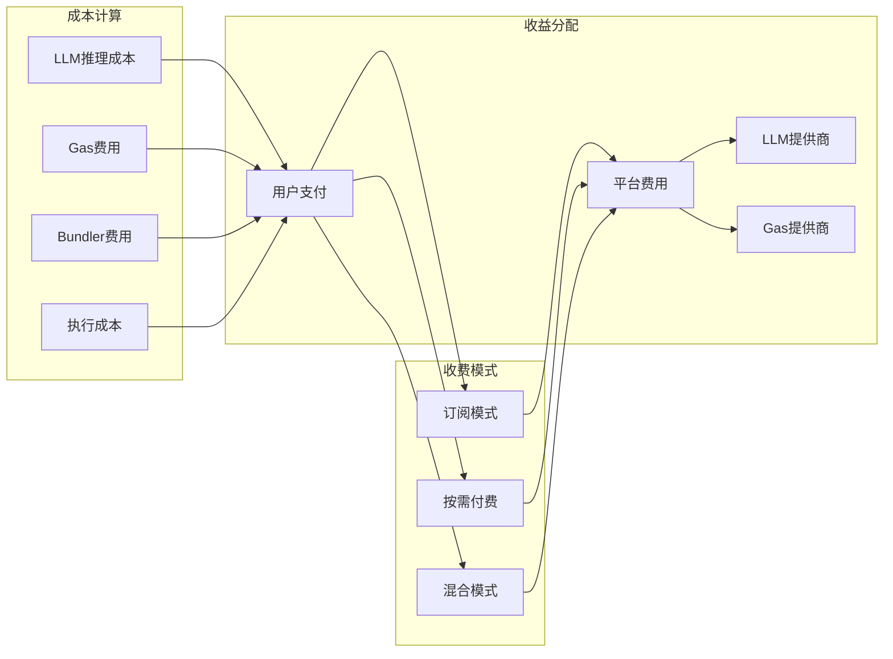
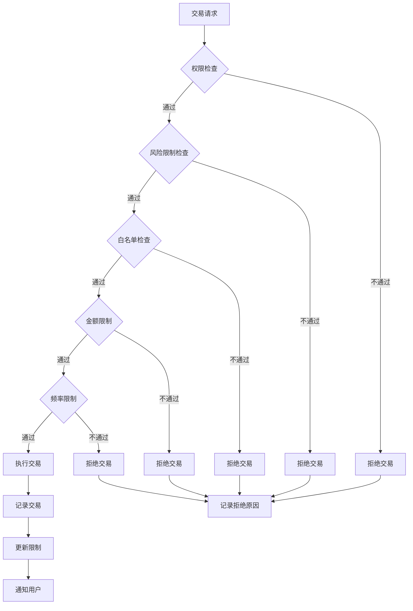
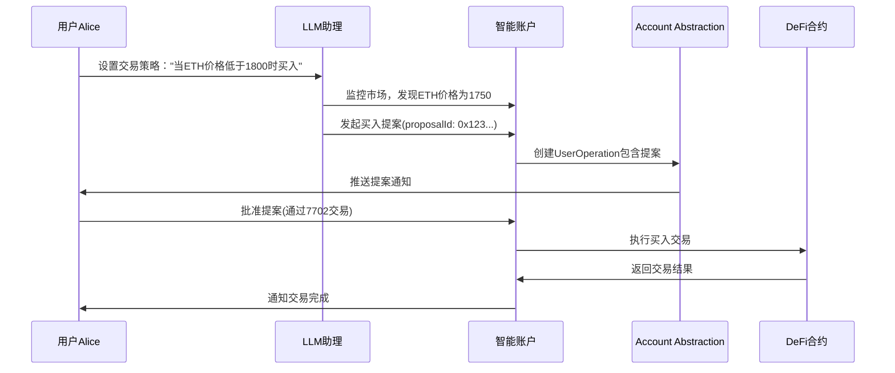

# LLM智能助理链上模型设计

基于EIP-4337与EIP-7702的智能抽象账户架构

## 目录
- [核心思路分析](#核心思路分析)
- [技术架构设计](#技术架构设计)
- [实现模型](#实现模型)
- [示例场景](#示例场景)
- [经济模型](#经济模型)
- [安全控制](#安全控制)
- [扩展性设计](#扩展性设计)


## 核心思路分析

### 核心思想

构造一个**智能抽象账户模型**，将LLM作为链上的"数字助理"，通过交易类型扩展来实现智能化的链上交互。

#### 关键概念
1. **智能抽象账户**: LLM作为链上的数字助理，拥有自己的私钥和签名能力
2. **交易类型扩展**: 新增交易类型(如0x7)让LLM能够发起智能交易
3. **分层控制**: 用户通过7702控制，LLM通过新交易类型提案，整体用4337编排
4. **可追溯性**: 所有LLM行为都有链上记录，不能没有痕迹

#### 技术架构思路
- **基础协议**: EIP-4337 (Account Abstraction) + EIP-7702 (Transaction Type Extension)
- **核心创新**: 新增交易类型让LLM能够发起智能交易
- **控制模型**: 用户通过7702控制，LLM通过新交易类型提案，整体用4337编排

## 技术架构设计

### 1. 系统整体架构图



### 2. 交易流程图



### 3. 角色交互流程图



### 4. 协议组合关系图



### 5. 数据流图



### 6. 权限控制流程图



### 7. 经济模型流程图



### 8. 安全控制流程图



## 实现模型

### 1. 智能抽象账户结构

```solidity
// 智能助理账户合约
contract LLMAgentAccount {
    address public owner;           // 用户EOA
    address public llmAgent;        // LLM助理地址
    mapping(bytes32 => Proposal) public proposals;
    
    struct Proposal {
        bytes32 proposalId;
        address target;
        bytes data;
        uint256 value;
        bool approved;
        bool executed;
        string description;         // LLM生成的语义描述
        uint256 timestamp;
        bytes llmContext;          // LLM上下文信息
    }
    
    event ProposalCreated(bytes32 indexed proposalId, string description);
    event ProposalApproved(bytes32 indexed proposalId);
    event ProposalExecuted(bytes32 indexed proposalId, bool success);
    
    modifier onlyOwner() {
        require(msg.sender == owner, "Only owner can call");
        _;
    }
    
    modifier onlyLLMAgent() {
        require(msg.sender == llmAgent, "Only LLM agent can call");
        _;
    }
    
    // LLM发起提案
    function proposeAction(
        address target,
        bytes calldata data,
        uint256 value,
        string calldata description,
        bytes calldata llmContext
    ) external onlyLLMAgent returns (bytes32 proposalId) {
        proposalId = keccak256(abi.encodePacked(
            target,
            data,
            value,
            description,
            block.timestamp
        ));
        
        proposals[proposalId] = Proposal({
            proposalId: proposalId,
            target: target,
            data: data,
            value: value,
            approved: false,
            executed: false,
            description: description,
            timestamp: block.timestamp,
            llmContext: llmContext
        });
        
        emit ProposalCreated(proposalId, description);
    }
    
    // 用户批准提案
    function approveProposal(bytes32 proposalId) external onlyOwner {
        Proposal storage proposal = proposals[proposalId];
        require(!proposal.approved, "Proposal already approved");
        require(!proposal.executed, "Proposal already executed");
        
        proposal.approved = true;
        emit ProposalApproved(proposalId);
    }
    
    // 执行提案
    function executeProposal(bytes32 proposalId) external onlyOwner {
        Proposal storage proposal = proposals[proposalId];
        require(proposal.approved, "Proposal not approved");
        require(!proposal.executed, "Proposal already executed");
        
        proposal.executed = true;
        
        (bool success, ) = proposal.target.call{value: proposal.value}(proposal.data);
        emit ProposalExecuted(proposalId, success);
    }
}
```

### 2. 新交易类型定义

```solidity
// 新交易类型 0x7: LLM智能交易
struct LLMTransaction {
    uint8 txType;          // 0x7
    address agentAccount;   // 智能助理账户
    bytes32 proposalId;     // 提案ID
    bytes llmContext;       // LLM上下文信息
    bytes signature;        // LLM签名
    uint256 nonce;         // 防重放
    uint256 gasLimit;      // Gas限制
    uint256 maxFeePerGas;  // 最大Gas费用
    uint256 maxPriorityFeePerGas; // 最大优先费用
}

// LLM交易验证器
contract LLMTransactionValidator {
    function validateLLMTransaction(
        LLMTransaction calldata tx
    ) external view returns (bool) {
        // 验证交易类型
        require(tx.txType == 0x7, "Invalid transaction type");
        
        // 验证LLM签名
        bytes32 messageHash = keccak256(abi.encodePacked(
            tx.agentAccount,
            tx.proposalId,
            tx.llmContext,
            tx.nonce
        ));
        
        address signer = ecrecover(messageHash, 
            uint8(tx.signature[0]), 
            bytes32(tx.signature[1:33]), 
            bytes32(tx.signature[33:65])
        );
        
        // 验证签名者是否为授权的LLM
        return LLMAgentAccount(tx.agentAccount).llmAgent() == signer;
    }
}
```

### 3. 角色基础模型

```solidity
// 基础角色合约
contract BaseRole {
    address public owner;
    string public roleName;
    PermissionLevel public permissionLevel;
    
    enum PermissionLevel {
        READ_ONLY,      // 只读权限
        PROPOSE_ONLY,   // 只能提案
        EXECUTE_LIMITED, // 有限执行权限
        FULL_CONTROL     // 完全控制
    }
    
    modifier onlyOwner() {
        require(msg.sender == owner, "Only owner can call");
        _;
    }
    
    modifier checkPermission(PermissionLevel required) {
        require(uint8(permissionLevel) >= uint8(required), "Insufficient permission");
        _;
    }
    
    function updatePermission(PermissionLevel newLevel) external onlyOwner {
        permissionLevel = newLevel;
    }
}

// DeFi交易助理合约
contract DeFiAgent is BaseRole {
    struct TradingStrategy {
        address token;
        uint256 targetPrice;
        bool isBuy;
        uint256 amount;
        uint256 slippage;
        bool active;
    }
    
    mapping(bytes32 => TradingStrategy) public strategies;
    
    event StrategyCreated(bytes32 indexed strategyId, address token, uint256 targetPrice);
    event TradeExecuted(bytes32 indexed strategyId, address token, uint256 amount, bool isBuy);
    
    function createStrategy(
        address token,
        uint256 targetPrice,
        bool isBuy,
        uint256 amount,
        uint256 slippage
    ) external onlyOwner returns (bytes32 strategyId) {
        strategyId = keccak256(abi.encodePacked(
            token,
            targetPrice,
            isBuy,
            amount,
            block.timestamp
        ));
        
        strategies[strategyId] = TradingStrategy({
            token: token,
            targetPrice: targetPrice,
            isBuy: isBuy,
            amount: amount,
            slippage: slippage,
            active: true
        });
        
        emit StrategyCreated(strategyId, token, targetPrice);
    }
    
    function createBuyProposal(
        address token,
        uint256 currentPrice,
        uint256 targetPrice,
        uint256 amount
    ) external checkPermission(PermissionLevel.PROPOSE_ONLY) returns (bytes32 proposalId) {
        // LLM生成提案
        string memory description = string(abi.encodePacked(
            "建议买入 ", amount, " 个 ", token,
            " 当前价格: ", currentPrice,
            " 目标价格: ", targetPrice
        ));
        
        return _createProposal(
            address(dexContract),
            abi.encodeWithSelector(
                dexContract.swapExactETHForTokens.selector,
                amount,
                token
            ),
            description
        );
    }
}
```

## 示例场景

### DeFi自动交易助理

#### 场景描述
用户Alice想要一个DeFi交易助理，能够监控市场并自动执行交易策略。

#### 完整流程



#### 具体实现代码

```solidity
// DeFi交易助理实现
contract DeFiTradingAssistant {
    address public dexContract;
    mapping(address => uint256) public lastPrices;
    
    function monitorAndPropose(
        address token,
        uint256 currentPrice,
        bytes32 strategyId
    ) external returns (bytes32 proposalId) {
        TradingStrategy memory strategy = strategies[strategyId];
        
        if (strategy.isBuy && currentPrice <= strategy.targetPrice) {
            // 生成买入提案
            proposalId = createBuyProposal(token, currentPrice, strategy.targetPrice, strategy.amount);
        } else if (!strategy.isBuy && currentPrice >= strategy.targetPrice) {
            // 生成卖出提案
            proposalId = createSellProposal(token, currentPrice, strategy.targetPrice, strategy.amount);
        }
        
        lastPrices[token] = currentPrice;
    }
    
    function createBuyProposal(
        address token,
        uint256 currentPrice,
        uint256 targetPrice,
        uint256 amount
    ) internal returns (bytes32 proposalId) {
        string memory description = string(abi.encodePacked(
            "自动买入建议: 当前", token, "价格为", currentPrice,
            "，低于目标价格", targetPrice,
            "，建议买入", amount, "个代币"
        ));
        
        bytes memory swapData = abi.encodeWithSelector(
            dexContract.swapExactETHForTokens.selector,
            amount,
            token,
            address(this),
            block.timestamp + 300
        );
        
        return agentAccount.proposeAction(
            address(dexContract),
            swapData,
            0,
            description,
            abi.encode(currentPrice, targetPrice, amount)
        );
    }
}
```

### NFT管理助理

#### 场景描述
用户Bob需要一个NFT管理助理，能够自动管理NFT收藏，包括买卖、质押等操作。

```solidity
contract NFTManagementAssistant {
    struct NFTStrategy {
        address collection;
        uint256 floorPrice;
        bool autoBuy;
        bool autoSell;
        uint256 maxBuyPrice;
        uint256 minSellPrice;
    }
    
    function proposeNFTTrade(
        address collection,
        uint256 tokenId,
        bool isBuy,
        uint256 price,
        string memory reason
    ) external returns (bytes32 proposalId) {
        string memory description = string(abi.encodePacked(
            isBuy ? "建议购买" : "建议出售",
            " NFT: ", collection, " #", tokenId,
            " 价格: ", price, " ETH",
            " 原因: ", reason
        ));
        
        bytes memory tradeData = abi.encodeWithSelector(
            isBuy ? marketplace.buyNFT.selector : marketplace.sellNFT.selector,
            collection,
            tokenId,
            price
        );
        
        return agentAccount.proposeAction(
            address(marketplace),
            tradeData,
            isBuy ? price : 0,
            description,
            abi.encode(collection, tokenId, price, isBuy)
        );
    }
}
```

## 经济模型

### 1. 分层Gas模型

```solidity
struct GasModel {
    uint256 userGas;      // 用户支付的gas
    uint256 llmGas;       // LLM推理gas
    uint256 executionGas; // 执行gas
    uint256 bundlerGas;   // Bundler打包gas
}

contract GasManager {
    mapping(address => GasModel) public userGasModels;
    
    function calculateTotalGas(
        address user,
        uint256 baseGas,
        uint256 llmComplexity
    ) external view returns (uint256 totalGas) {
        GasModel memory model = userGasModels[user];
        
        totalGas = baseGas + 
                   (model.llmGas * llmComplexity) + 
                   model.executionGas + 
                   model.bundlerGas;
    }
}
```

### 2. 订阅模式

```solidity
contract SubscriptionModel {
    enum SubscriptionTier {
        BASIC,      // 基础订阅
        PREMIUM,    // 高级订阅
        ENTERPRISE  // 企业订阅
    }
    
    struct Subscription {
        SubscriptionTier tier;
        uint256 monthlyFee;
        uint256 gasAllowance;
        uint256 maxTransactions;
        bool active;
        uint256 startTime;
    }
    
    mapping(address => Subscription) public subscriptions;
    
    function createSubscription(
        SubscriptionTier tier
    ) external payable {
        require(msg.value >= getTierFee(tier), "Insufficient payment");
        
        subscriptions[msg.sender] = Subscription({
            tier: tier,
            monthlyFee: getTierFee(tier),
            gasAllowance: getTierGasAllowance(tier),
            maxTransactions: getTierMaxTransactions(tier),
            active: true,
            startTime: block.timestamp
        });
    }
    
    function getTierFee(SubscriptionTier tier) internal pure returns (uint256) {
        if (tier == SubscriptionTier.BASIC) return 0.01 ether;
        if (tier == SubscriptionTier.PREMIUM) return 0.05 ether;
        if (tier == SubscriptionTier.ENTERPRISE) return 0.2 ether;
        return 0;
    }
}
```

### 3. 按需付费模型

```solidity
contract PayPerUseModel {
    struct Usage {
        uint256 llmTokens;
        uint256 gasUsed;
        uint256 complexity;
        uint256 timestamp;
    }
    
    mapping(address => Usage[]) public userUsage;
    
    function recordUsage(
        address user,
        uint256 llmTokens,
        uint256 gasUsed,
        uint256 complexity
    ) external {
        userUsage[user].push(Usage({
            llmTokens: llmTokens,
            gasUsed: gasUsed,
            complexity: complexity,
            timestamp: block.timestamp
        }));
    }
    
    function calculateFee(
        address user,
        uint256 startTime,
        uint256 endTime
    ) external view returns (uint256 totalFee) {
        Usage[] memory usage = userUsage[user];
        
        for (uint i = 0; i < usage.length; i++) {
            if (usage[i].timestamp >= startTime && usage[i].timestamp <= endTime) {
                totalFee += (usage[i].llmTokens * 0.0001 ether) + 
                           (usage[i].gasUsed * 0.000001 ether) +
                           (usage[i].complexity * 0.001 ether);
            }
        }
    }
}
```

## 安全控制

### 1. 权限分级系统

```solidity
contract PermissionManager {
    enum PermissionLevel {
        READ_ONLY,      // 只读权限
        PROPOSE_ONLY,   // 只能提案
        EXECUTE_LIMITED, // 有限执行权限
        FULL_CONTROL     // 完全控制
    }
    
    struct Role {
        string name;
        PermissionLevel level;
        uint256 maxAmount;
        address[] allowedContracts;
        bool active;
    }
    
    mapping(address => Role) public userRoles;
    
    function createRole(
        string memory name,
        PermissionLevel level,
        uint256 maxAmount,
        address[] memory allowedContracts
    ) external returns (bytes32 roleId) {
        roleId = keccak256(abi.encodePacked(name, block.timestamp));
        
        userRoles[msg.sender] = Role({
            name: name,
            level: level,
            maxAmount: maxAmount,
            allowedContracts: allowedContracts,
            active: true
        });
    }
}
```

### 2. 风险控制机制

```solidity
contract RiskController {
    struct RiskLimits {
        uint256 maxSingleTransaction;
        uint256 maxDailyVolume;
        uint256 maxGasPerTransaction;
        uint256 cooldownPeriod;
        bool emergencyStop;
    }
    
    mapping(address => RiskLimits) public userRiskLimits;
    
    function setRiskLimits(
        uint256 maxSingleTransaction,
        uint256 maxDailyVolume,
        uint256 maxGasPerTransaction,
        uint256 cooldownPeriod
    ) external {
        userRiskLimits[msg.sender] = RiskLimits({
            maxSingleTransaction: maxSingleTransaction,
            maxDailyVolume: maxDailyVolume,
            maxGasPerTransaction: maxGasPerTransaction,
            cooldownPeriod: cooldownPeriod,
            emergencyStop: false
        });
    }
    
    function checkRiskLimits(
        address user,
        uint256 amount,
        uint256 gasUsed
    ) external view returns (bool) {
        RiskLimits memory limits = userRiskLimits[user];
        
        if (limits.emergencyStop) return false;
        if (amount > limits.maxSingleTransaction) return false;
        if (gasUsed > limits.maxGasPerTransaction) return false;
        
        return true;
    }
    
    function emergencyStop(address user) external {
        require(msg.sender == user, "Only user can stop");
        userRiskLimits[user].emergencyStop = true;
    }
}
```

### 3. 白名单系统

```solidity
contract WhitelistManager {
    mapping(address => mapping(address => bool)) public allowedContracts;
    mapping(address => address[]) public userWhitelist;
    
    function addToWhitelist(address contractAddress) external {
        allowedContracts[msg.sender][contractAddress] = true;
        userWhitelist[msg.sender].push(contractAddress);
    }
    
    function removeFromWhitelist(address contractAddress) external {
        allowedContracts[msg.sender][contractAddress] = false;
    }
    
    function isWhitelisted(address user, address contractAddress) external view returns (bool) {
        return allowedContracts[user][contractAddress];
    }
}
```

## 扩展性设计

### 1. 多角色支持

```solidity
contract MultiRoleAgent {
    mapping(bytes32 => Role) public roles;
    mapping(address => bytes32[]) public userRoles;
    
    struct Role {
        string name;           // 角色名称
        address agent;         // 角色合约
        PermissionLevel level; // 权限级别
        bytes32 template;      // 模板ID
        bool active;           // 是否激活
    }
    
    function createRole(
        string memory name,
        address agent,
        PermissionLevel level,
        bytes32 template
    ) external returns (bytes32 roleId) {
        roleId = keccak256(abi.encodePacked(name, msg.sender, block.timestamp));
        
        roles[roleId] = Role({
            name: name,
            agent: agent,
            level: level,
            template: template,
            active: true
        });
        
        userRoles[msg.sender].push(roleId);
    }
    
    function activateRole(bytes32 roleId) external {
        require(roles[roleId].agent != address(0), "Role does not exist");
        roles[roleId].active = true;
    }
    
    function deactivateRole(bytes32 roleId) external {
        require(roles[roleId].agent != address(0), "Role does not exist");
        roles[roleId].active = false;
    }
}
```

### 2. 模板系统

```solidity
contract TemplateSystem {
    struct Template {
        string name;
        string description;
        bytes code;
        bytes32 category;
        uint256 version;
        bool verified;
        address creator;
    }
    
    mapping(bytes32 => Template) public templates;
    mapping(bytes32 => bytes32[]) public categoryTemplates;
    
    function createTemplate(
        string memory name,
        string memory description,
        bytes memory code,
        bytes32 category
    ) external returns (bytes32 templateId) {
        templateId = keccak256(abi.encodePacked(name, msg.sender, block.timestamp));
        
        templates[templateId] = Template({
            name: name,
            description: description,
            code: code,
            category: category,
            version: 1,
            verified: false,
            creator: msg.sender
        });
        
        categoryTemplates[category].push(templateId);
    }
    
    function instantiateTemplate(
        bytes32 templateId,
        bytes memory parameters
    ) external returns (address instance) {
        Template memory template = templates[templateId];
        require(template.verified, "Template not verified");
        
        // 使用CREATE2部署模板实例
        bytes32 salt = keccak256(abi.encodePacked(msg.sender, templateId, block.timestamp));
        instance = Create2.deploy(0, salt, template.code);
        
        // 初始化实例
        (bool success, ) = instance.call(parameters);
        require(success, "Template instantiation failed");
    }
}
```

### 3. 插件系统

```solidity
contract PluginSystem {
    struct Plugin {
        string name;
        address implementation;
        bytes32 interfaceId;
        bool active;
        uint256 version;
    }
    
    mapping(bytes32 => Plugin) public plugins;
    mapping(address => bytes32[]) public userPlugins;
    
    function registerPlugin(
        string memory name,
        address implementation,
        bytes32 interfaceId
    ) external returns (bytes32 pluginId) {
        pluginId = keccak256(abi.encodePacked(name, implementation, block.timestamp));
        
        plugins[pluginId] = Plugin({
            name: name,
            implementation: implementation,
            interfaceId: interfaceId,
            active: true,
            version: 1
        });
    }
    
    function installPlugin(address user, bytes32 pluginId) external {
        require(plugins[pluginId].active, "Plugin not active");
        userPlugins[user].push(pluginId);
    }
    
    function executePlugin(
        bytes32 pluginId,
        bytes memory data
    ) external returns (bytes memory result) {
        Plugin memory plugin = plugins[pluginId];
        require(plugin.active, "Plugin not active");
        
        (bool success, bytes memory retData) = plugin.implementation.call(data);
        require(success, "Plugin execution failed");
        
        return retData;
    }
}
```

## 总结

这个LLM智能助理链上模型的核心优势包括：

### 1. 可追溯性
- 所有LLM行为都有链上记录
- 完整的交易历史和提案记录
- 透明的决策过程

### 2. 可控性
- 用户始终拥有最终控制权
- 分级权限管理
- 紧急停止机制

### 3. 可扩展性
- 基于现有协议扩展，兼容性强
- 模块化设计，支持插件系统
- 多角色和多模板支持

### 4. 经济自洽
- 通过gas模型实现经济闭环
- 灵活的订阅和按需付费模式
- 合理的成本分摊机制

### 5. 安全性
- 多层安全控制机制
- 风险限制和监控
- 白名单和权限管理

这个模型为LLM在区块链上的应用提供了一个完整的框架，既保证了智能化的便利性，又确保了安全性和可控性。 