# LLM智能助理链上模型 - 图形化设计

## 🎯 核心概念图

### 智能抽象账户模型
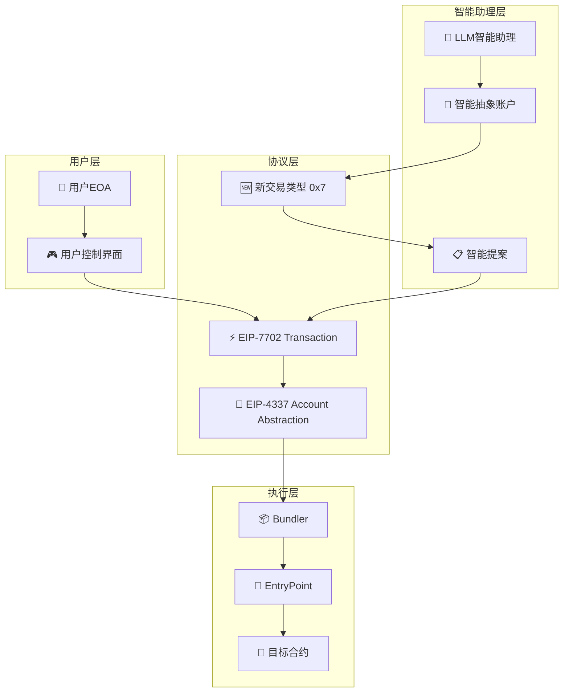

## 🔄 完整交易流程

### 智能交易执行流程
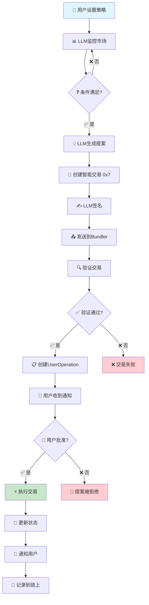

## 🏗️ 系统架构图

### 分层架构设计
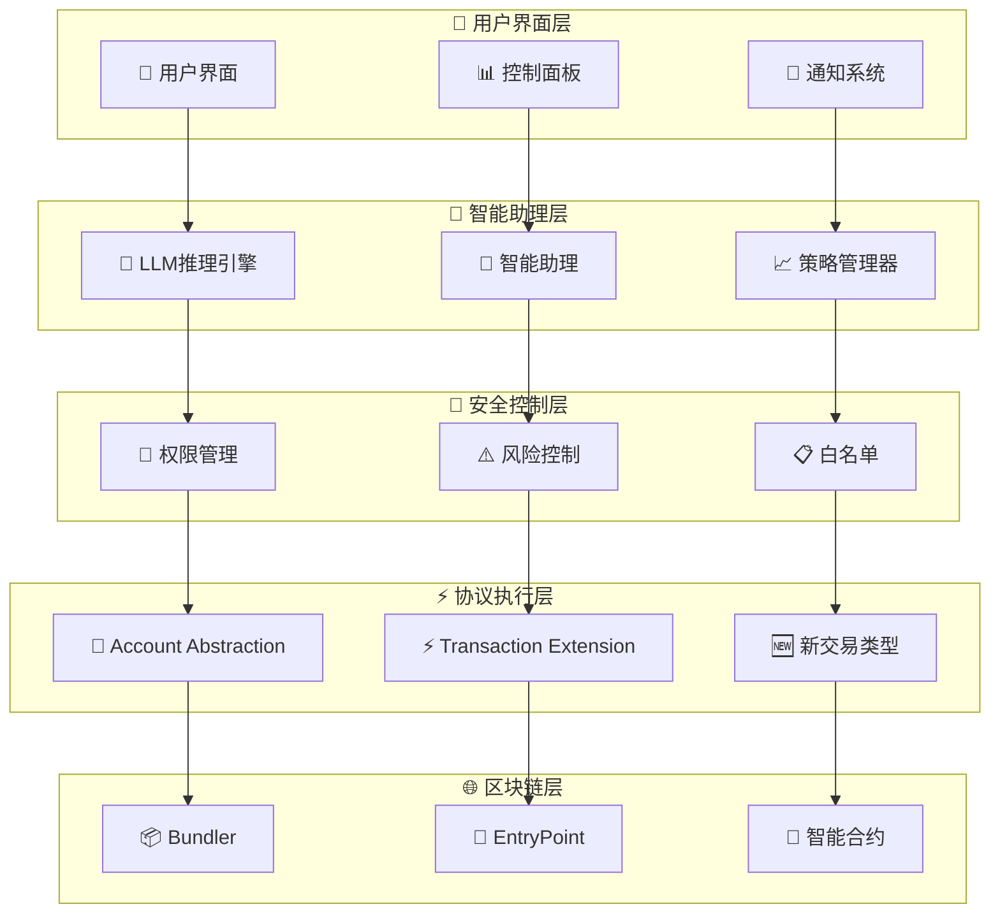

## 💰 经济模型图

### 成本收益流
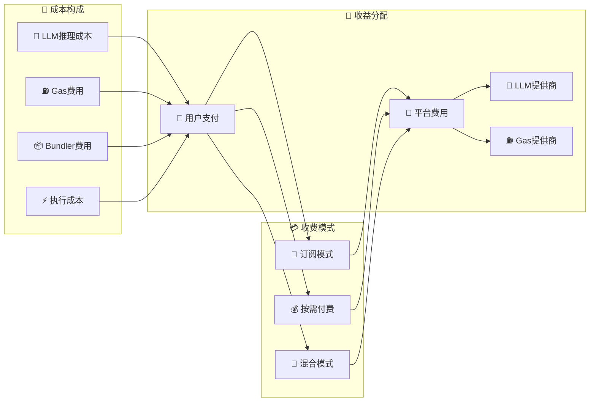

## 🔒 安全控制体系

### 多层安全防护
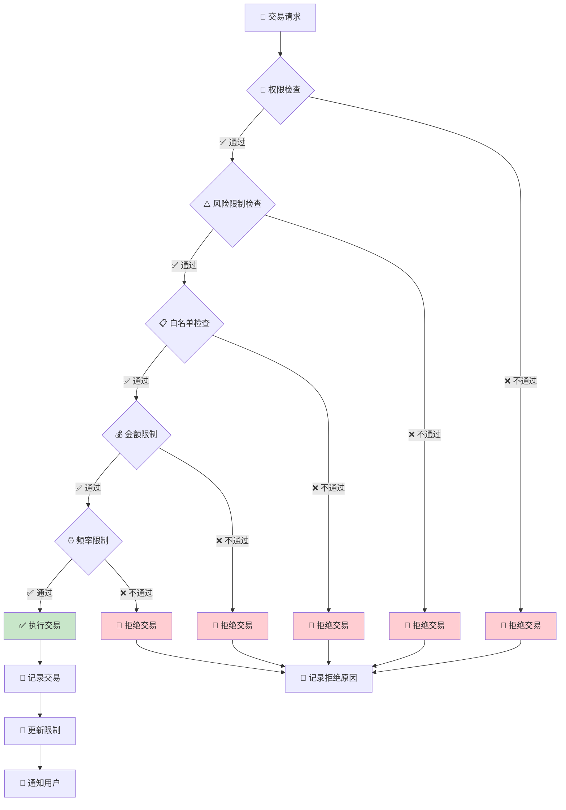

## 🎭 角色交互图

### 多角色协作流程
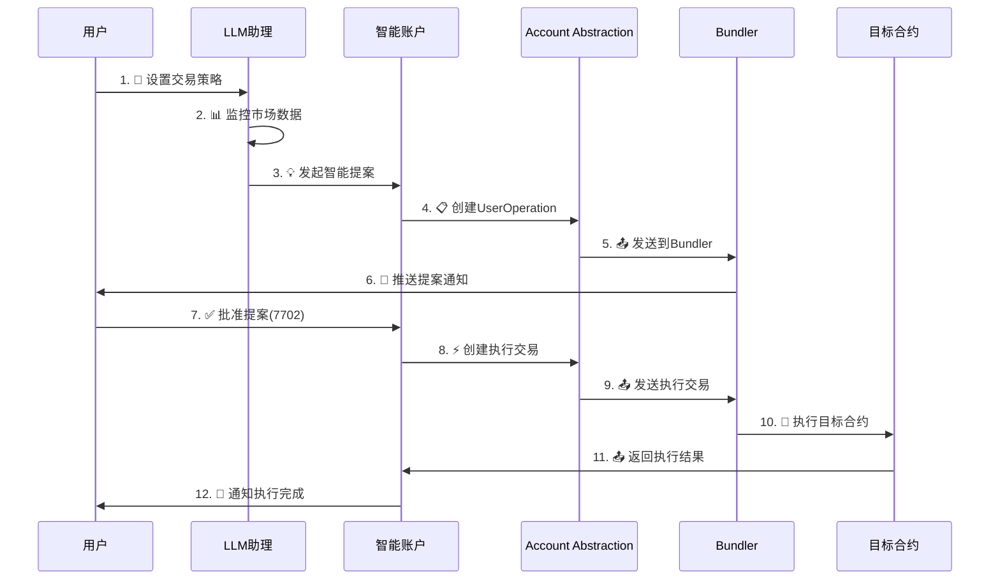

## 📊 数据流图

### 信息流动路径
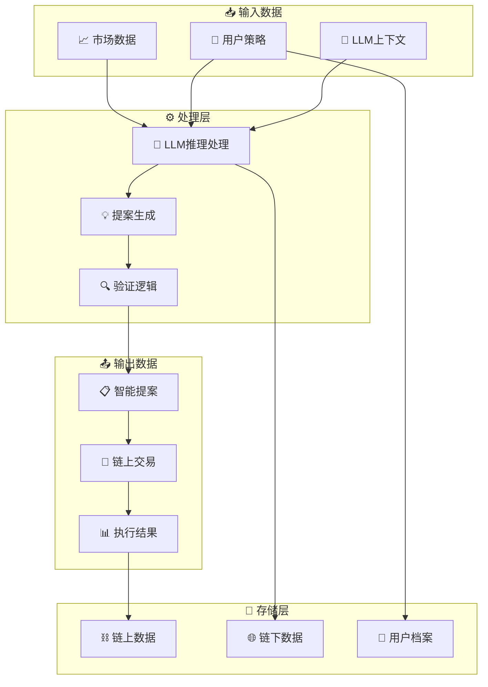

## 🎨 权限控制图

### 分级权限管理
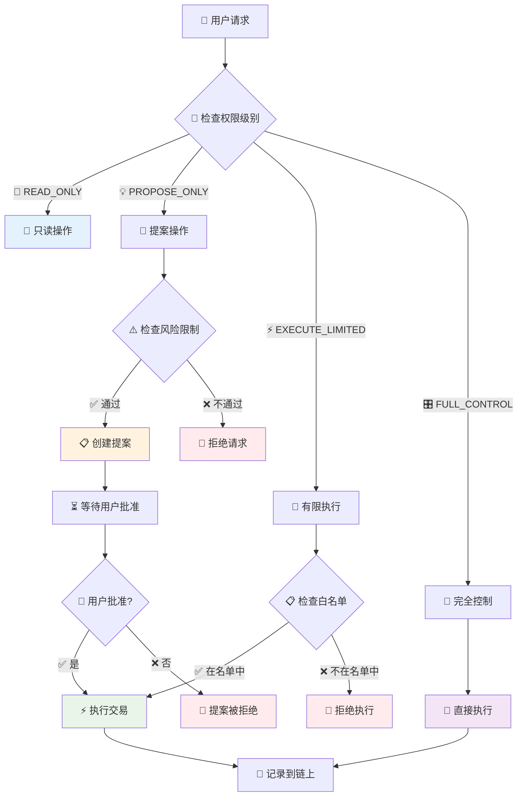

## 🔧 扩展性设计图

### 模块化架构
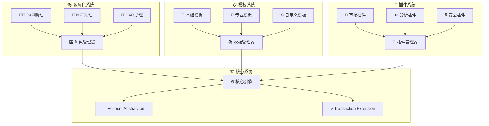

## 🎯 应用场景图

### DeFi自动交易场景
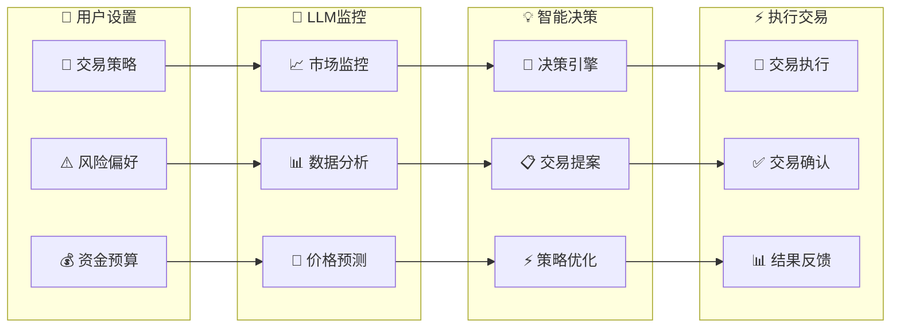

## 📈 性能监控图

### 系统性能指标
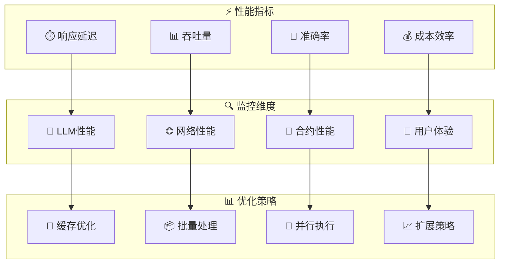

## 🎨 总结

这个图形化设计展示了LLM智能助理链上模型的完整架构，包括：

### 🌟 核心特点
- **🎯 智能决策**: LLM作为链上数字助理
- **🔐 安全可控**: 多层安全防护机制
- **💰 经济自洽**: 完整的成本收益模型
- **🔧 高度可扩展**: 模块化设计支持多种应用场景

### 🚀 技术优势
- **📊 可视化流程**: 清晰展示系统各组件关系
- **🎭 角色化设计**: 支持多种专业助理角色
- **⚡ 高效执行**: 优化的交易执行流程
- **🔒 安全可靠**: 完善的风险控制体系

这个图形化设计为理解和实现LLM智能助理链上模型提供了直观的视觉指导。 