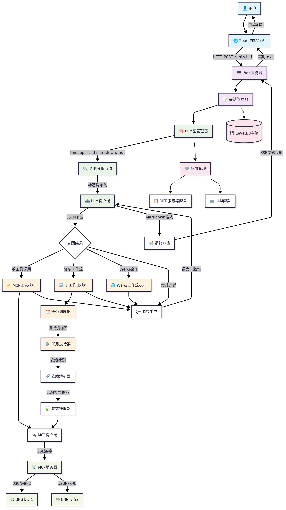
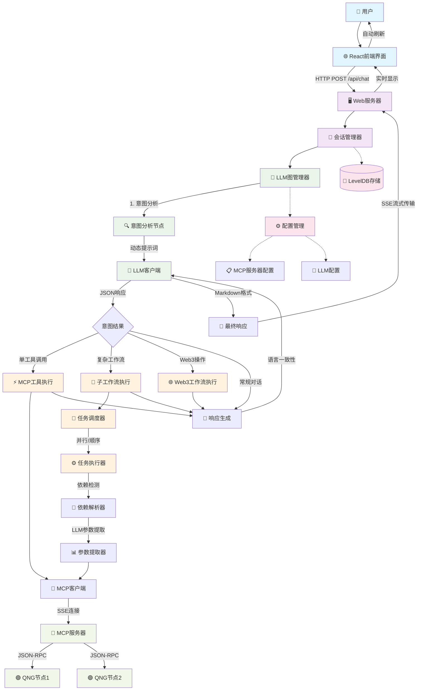
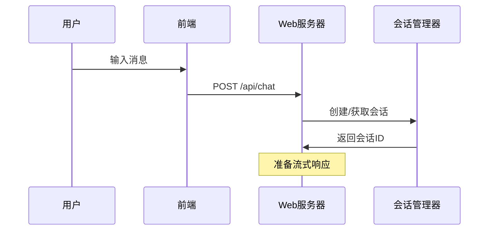
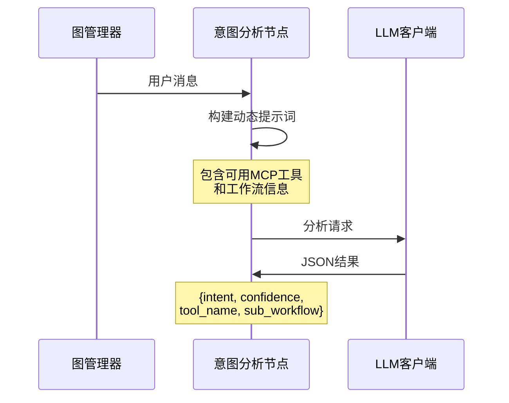
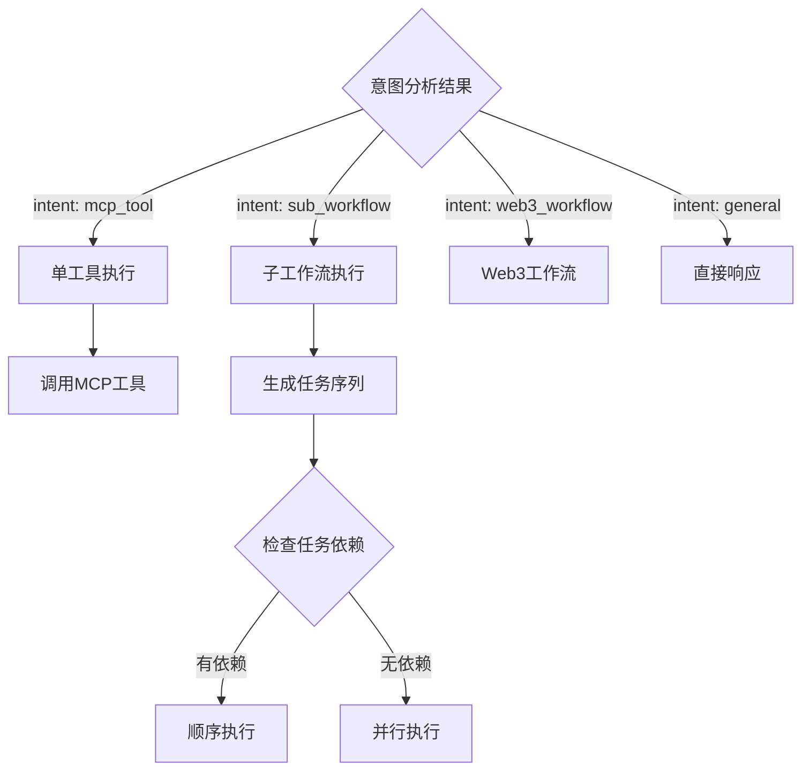
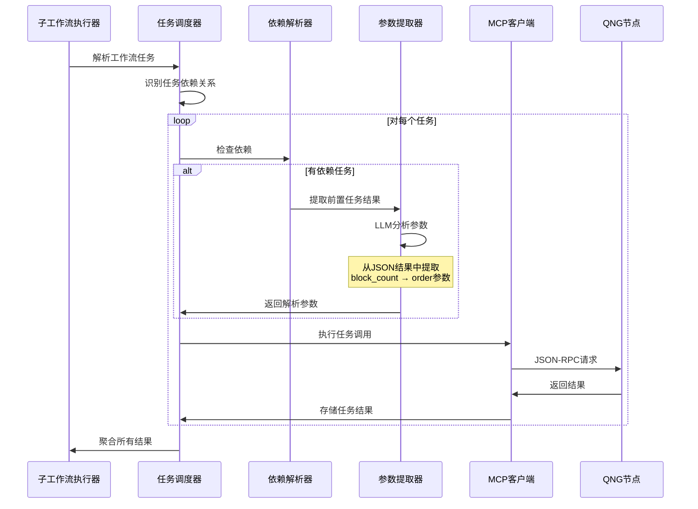
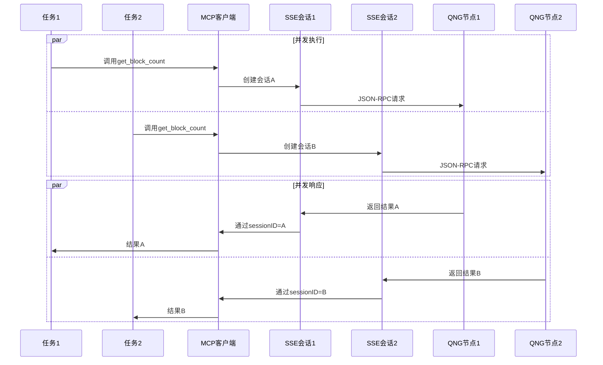
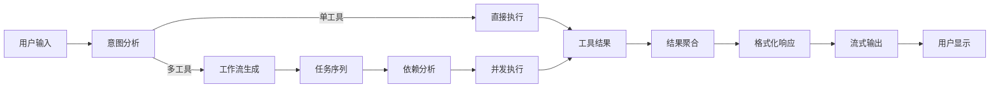

# QNG智能体系统架构图

## 📋 系统概览

QNG智能体是一个基于LLM驱动的区块链操作系统，支持多RPC节点查询、智能工作流编排和动态参数解析。



## 🔄 详细消息处理流程

### 1. 用户输入阶段


### 2. 意图分析阶段


### 3. 工作流路由决策


### 4. 子工作流执行详细流程


### 5. MCP客户端并发处理


## 🏗️ 核心组件架构

### 1. LLM图管理器 (LLMGraphManager)
```
职责：
- 消息图的创建和编排
- 节点间的路由决策
- 上下文状态管理

关键方法：
- ProcessUserMessage() - 主入口
- intentAnalysisNode() - 意图分析
- routeAfterIntent() - 路由决策
```

### 2. MCP客户端 (MCP Client)
```
职责：
- 与MCP服务器的SSE通信
- 会话管理和连接池
- 并发请求处理

关键特性：
- sessionID-based连接管理
- 线程安全的并发访问
- 自动重连和错误处理
```

### 3. 子工作流执行器 (SubWorkflow Executor)
```
职责：
- 复杂任务的编排和执行
- 任务间依赖关系处理
- 结果聚合和分析

关键功能：
- 动态工作流生成
- LLM驱动的参数提取
- 并行/顺序执行模式
```

## 🔍 系统提示词架构

### 1. 意图分析提示词
```
功能：动态分析用户意图，生成结构化工作流
输入：用户消息 + 可用工具列表
输出：JSON格式的意图分析结果

关键特性：
- 自适应工具识别
- 依赖关系分析
- 工作流任务生成
```

### 2. 参数提取提示词
```
功能：从前置任务结果中提取后续任务所需参数
输入：前置任务JSON结果 + 当前任务定义
输出：解析后的参数映射

示例：
block_count: 13078095 → order: 13078095
```

### 3. 响应生成提示词
```
功能：生成用户友好的最终响应
特性：
- 语言一致性检测
- Markdown格式化
- 数据可视化表格
- 技术术语本地化
```

## 📊 数据流转架构



## 🚀 关键技术特性

1. **动态工作流生成** - LLM分析用户意图，自动生成执行计划
2. **智能参数传递** - 自动解析任务间的数据依赖关系  
3. **并发执行优化** - sessionID隔离的并发MCP调用
4. **语言一致性** - 自动匹配用户语言进行响应
5. **流式用户体验** - 实时显示执行进度和结果
6. **容错恢复机制** - 自动重试和降级处理
7. **可扩展架构** - 插件化的工具和工作流系统

---

*此架构图基于实际代码分析生成，反映了QNG智能体的完整技术栈和数据流转过程。*